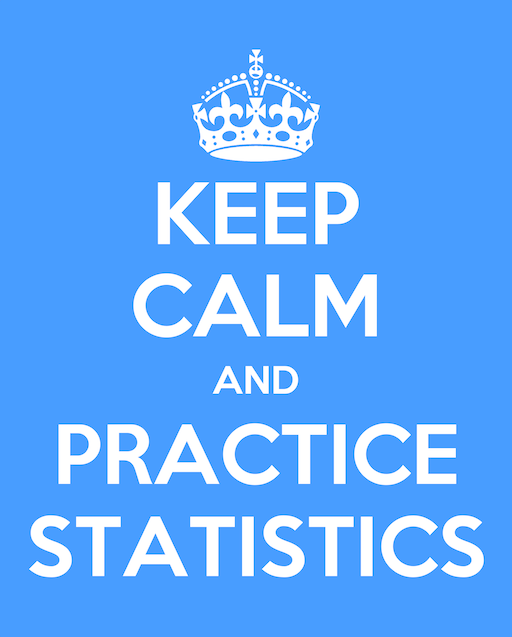

This is the **practice and solutions** page. If you want to download the data for an assignment to turn in, you're not in the right place. You need to go to the [assigned data download page](`r download_url`).

On this page you can select any assignment, obtain any number of practice data sets, and obtain the solutions for these data sets. You may work through an assignment as often as you like with these practice data sets. To get a new data practice set, just change the *ID number* or the *Secret*. 
If a question about an analysis with some practice data, be sure to note the *ID number* and *Secret* (in the left) that you were using, because anyone else with the same *ID number* and *Secret* will be able to obtain the exact same practice data set. That will enable them to help you better.

When you're ready to do your assignment and turn it in for marking, go to the [assigned data download page](`r download_url`) to retrieve your official assignment data set. 

<iframe width="560" height="315" src="https://www.youtube.com/embed/x5eRqUgD9c4" frameborder="0" allowfullscreen></iframe>

