```{r include=FALSE}
# This chunk allows standalone compilation
if(!exists("assignment")){
  seed = 124
  secret = "dgnvo"
  source("assignment.R")
  source("../../settings.R")
  solutions = FALSE
}

```

`r assignment`
-----


```{r include=FALSE}
knitr::opts_chunk$set(fig.width=5,fig.height=5)

require(stargazer)
require(broom)
all.data = getData(seed, secret, assignment)
myData = all.data[['data']]
infoData = all.data[['info']]
```


The (fictional) data set for this assignment has two columns, `x` and `y`. Download it from the link above, then load the data set into SPSS. Create a scatterplot with `x` and `y` as the independent and dependent variables respectively. Describe the pattern you see and choose one of the following measures of the strength of the correlation:

* Pearson's $r$
* Kendall's $\tau$
* None (correlation is inappropriate)

*Regardless of whether linear correlation is appropriate*, use the steps below to add the least squares linear regression line, perform the linear regression analysis, and then create a residual plot.

When you load the data into SPSS, you should see something like the screenshot below (though your data values will be different).

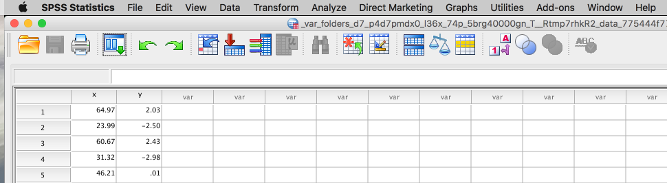


---------


### 1. Create a Scatterplot

* Start the "Chart builder" from the SPSS menu.


* Select a "simple scatter" plot from the menu in the bottom left of the chart builder.

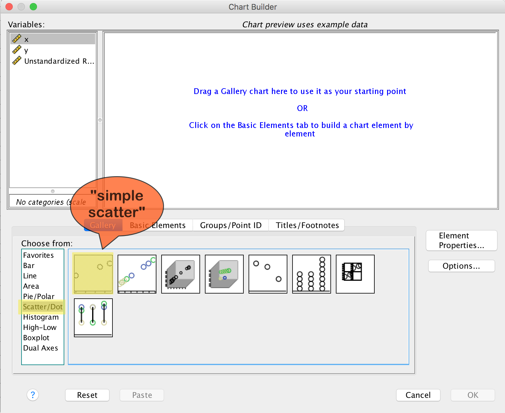

* Drag the "simple scatter" plot to the main chart builder window, then drag the `x` and `y` variables to the $x$- and $y$-axes, respectively.

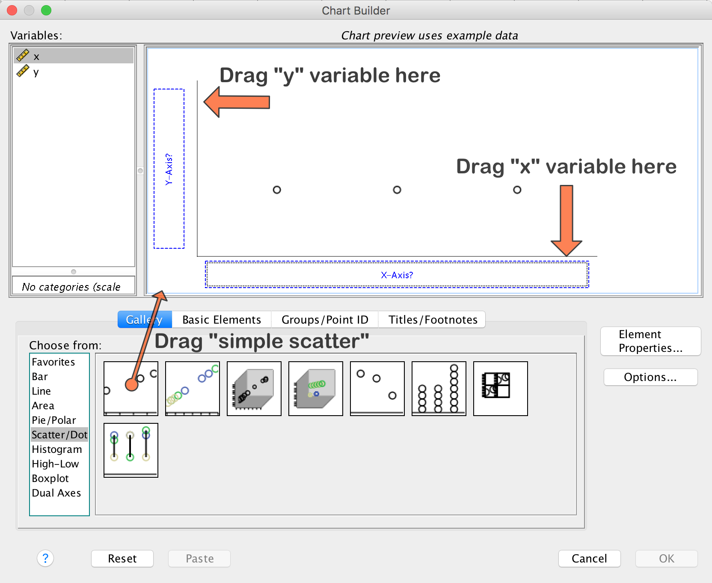

* Click "OK" to see your scatterplot.

```{r echo=FALSE,fig.cap="Scatterplot",include=solutions}

par(las=1,mar=c(3.5,3.5,4,.5),mgp=c(2.5,1,0))

x = myData$x
y = myData$y

res = lm(y~x)

plot(x, y, ylab="y",xlab="x",pch=1, main="Scatterplot")
rect(par("usr")[1], par("usr")[3], par("usr")[2], par("usr")[4], col = 
rgb(0,0,0,.05))
points(x,y)
abline(res, lwd=2)
```

```{r results='asis',echo=FALSE,include=solutions}
cat("#### Solution\n",
    infoData$text)
```


* To add the least squares regression line, double-click on the scatter plot to open the chart editor. Click "Add fit line at total".

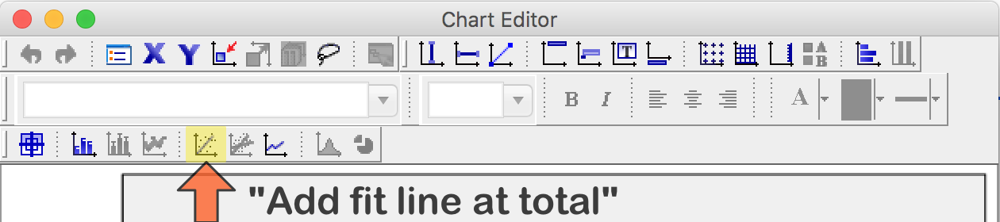

* Select the "Linear" fit method.

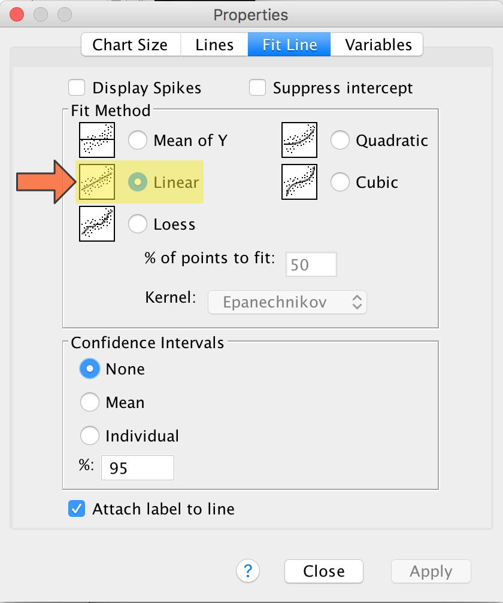


-------

### 2. Perform a linear regression analysis

We now perform the regression analysis. 

* Select "Analyze&rarr;Regression&rarr;Linear..." from the SPSS menu.

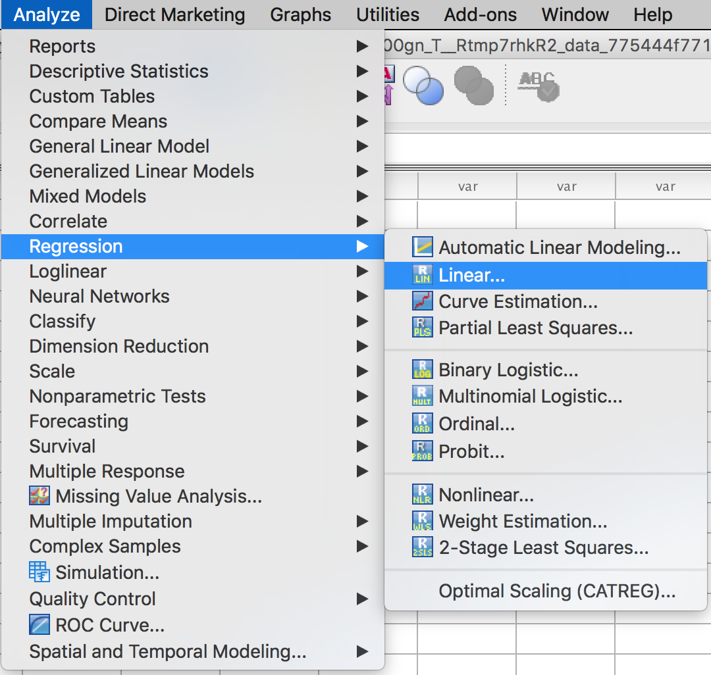

* Drag the variable `x` and `y` to the independent and dependent variable slots, respectively.

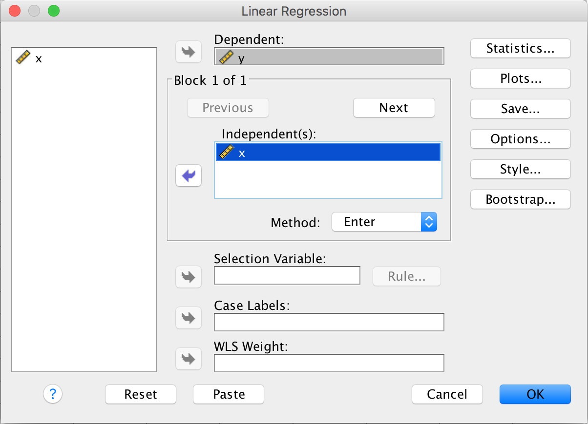

* We want to save the residuals for Part 3. Click "Save..." to open the menu...

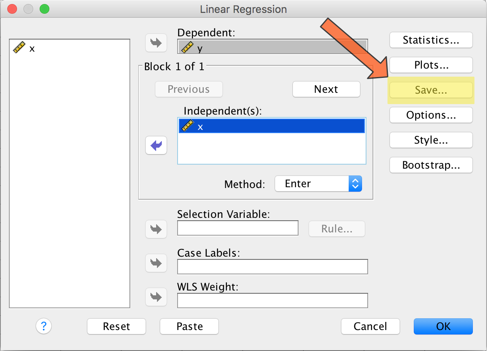

* &nbsp;...then click "Unstandardized" under "residuals". When we perform the linear regression analysis, this option will save a new variable containing the residual for every observation.

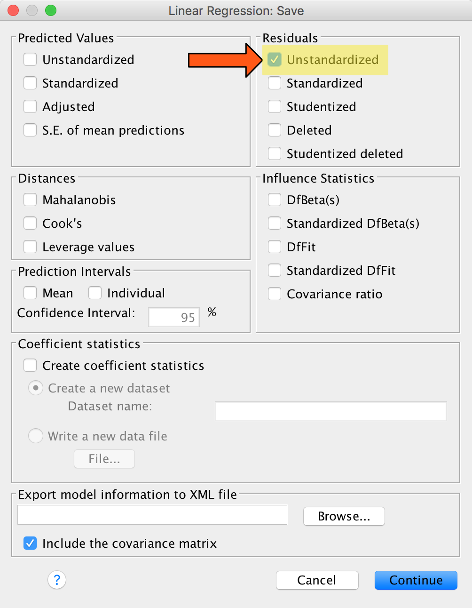

* Click "Continue" in the "Save..." menu and then "OK" in the "Linear Regression" menu to see the regression analysis.

```{r results='asis',echo=FALSE,include=solutions}
res = lm(y ~ x, dat=myData)

cat("#### Solution\n\n")
knitr::kable(tidy(res),digits = 4, format = "html", table.attr = "class=\"anovatab\"")

```

* After examining and interpreting the linear regression results &mdash; and ensuring they match with what you expect based on the scatter plot &mdash; go back to the data editor. You should see a new column containing the residuals for every observation. Your residuals will be different from the ones pictured below.

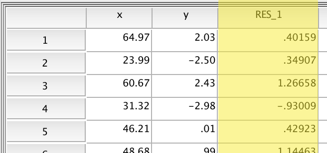

---------

## Part 3: Plot the residuals

The steps we will use to make a scatter plot of the residuals are basically the same as those we followed above to make a scatter plot of the data. 

* Start the chart builder, drag the "simple scatter" plot to the main chart builder window, then drag the `x` and `Unstandardized Residuals` variables to the $x$- and $y$ axes, respectively.

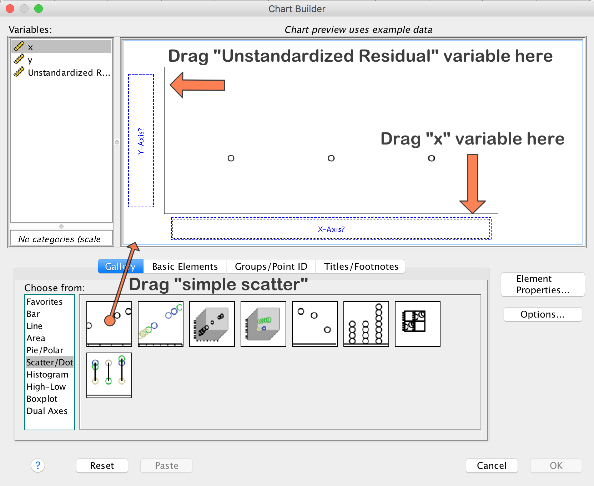

* Click "OK" to see your residual scatter plot (yours will not contain the red nonparametric regression line, as mine does below. I added this to help you see any pattern in the residuals).

```{r echo=FALSE,fig.cap="Residuals",include=solutions}

par(las=1,mar=c(3.5,3.5,4,.5),mgp=c(2.5,1,0))

plot(x, res$residuals, ylab="Residuals",xlab="x",pch=1, main="Residuals")
rect(par("usr")[1], par("usr")[3], par("usr")[2], par("usr")[4], col = 
rgb(0,0,0,.05))
points(x,res$residuals)
abline(h=0,lwd=2)
lines(lowess(res$residuals~x), col="red", lty=2)
```

* Add a horizontal line at $y=0$ &mdash; the mean of the residuals &mdash; by double-clicking on the chart to open the chart editor. As before, click "Add fit line to total", but now select the "Mean of Y" fit method.

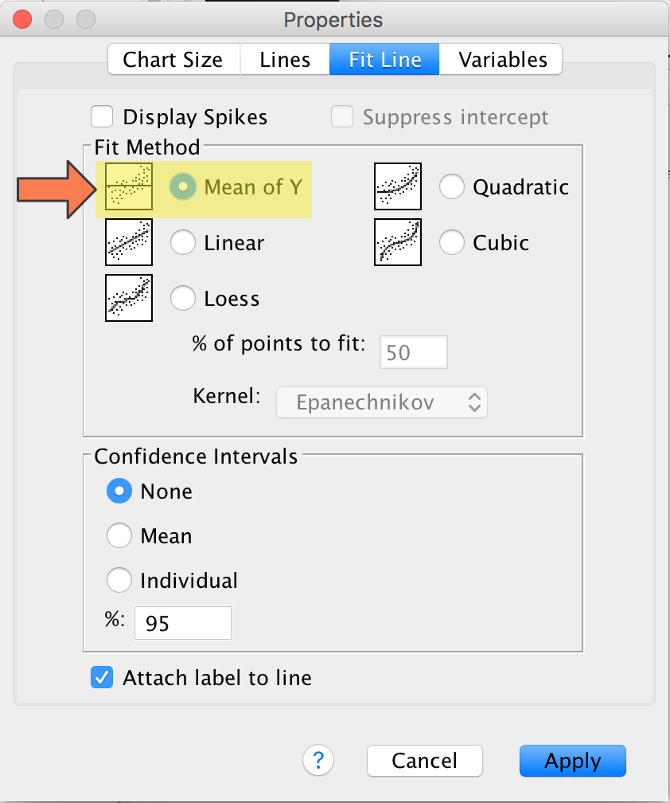


----------

## Part 4. Interpret the residuals

The residuals show how well the linear regression captures the relationship in the data. Ideally, we want residuals that show no systematic trends, such as curvilinearity or increasing/decreasing variance. A residual plot is often useful for magnifying any misfit of the regression line.

```{r echo=FALSE,child="child_sidebyside.Rmd",eval=solutions}
```

<br/><br/>
